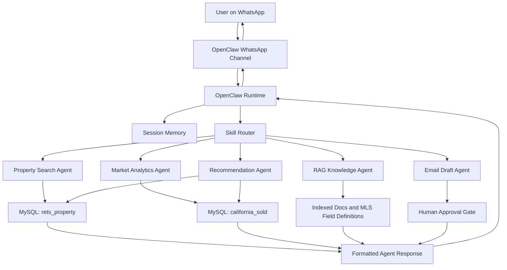

# IDX-Exchange-AI-Agent

Production-style multi-agent real estate assistant built with OpenClaw, OpenAI, MySQL MLS data, semantic search, RAG, WhatsApp integration, and human-in-the-loop safety workflows.

## Project Objective

Build a multi-agent AI assistant for real estate search and market intelligence. The system will let users search active MLS listings, ask market questions, receive property recommendations, and interact through WhatsApp using an OpenClaw-based agent runtime.

## Week 1: Architecture Fundamentals

This week focuses on understanding the OpenClaw architecture and documenting how user messages flow through the system.

## Core Concepts

OpenClaw is the orchestration layer that connects user messages, session state, skills, tools, and database-backed retrieval into one conversational workflow. The goal of Week 1 is to understand the moving parts clearly enough to explain how a message travels from WhatsApp into the system and back to the user as a response.

## Architecture Flow



## Key Components

- **Skills** — modular capability units such as property search, market stats, RAG, and recommendations
- **Channels** — communication interfaces such as WhatsApp, email, and web
- **Sessions** — per-user conversation state and memory
- **Tools** — typed async functions the agent can call for structured actions
- **Memory** — short-term session state plus long-term vector storage
- **Orchestrator** — routes each query to the correct skill or agent

## Basic Tool Definition

```ts
export async function getCurrentTime() {
  return { currentTime: new Date().toISOString() };
}

export async function handleMessage(message: string) {
  if (message.toLowerCase().includes("time")) {
    return await getCurrentTime();
  }

  return { response: "I could not understand the request." };
}
```

## Week 1 Deliverable

Architecture documentation with a workflow diagram showing how a user query moves from WhatsApp through OpenClaw skills to the MLS databases.

## Week 0 Status

- OpenClaw environment installed and running
- OpenAI API key configured
- WhatsApp test message working
- MySQL tables imported and verified

## Database Verification

The following tables were imported and cross-checked successfully:

- **rets_property**: 53,122 rows
- **california_sold**: 87,157 rows

## Planned Agent Modules

- Property search assistant
- Market analytics assistant
- Recommendation assistant
- RAG knowledge assistant
- Email drafting assistant
- Human approval workflow for sensitive actions

## Notes

This repository will be updated week by week as the project expands from architecture fundamentals into live query handling, retrieval workflows, and production-style agent orchestration.
