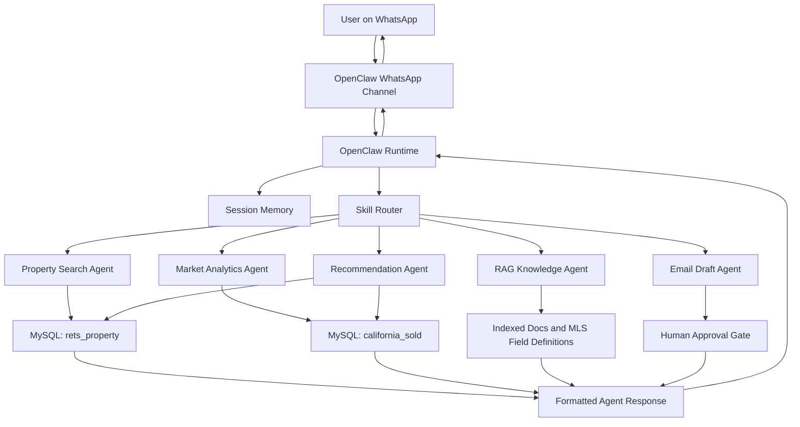

# IDX-Exchange-AI-Agent

Production-style multi-agent real estate assistant built with OpenClaw, OpenAI, MySQL MLS data, semantic search, RAG, WhatsApp integration, and human-in-the-loop safety workflows.

## Project Objective

Build a multi-agent AI assistant for real estate search and market intelligence. The system will let users search active MLS listings, ask market questions, receive property recommendations, and interact through WhatsApp using an OpenClaw-based agent runtime.

## Week 0 Status

- OpenClaw environment installed and running
- OpenAI API key configured
- WhatsApp test message working
- MySQL tables imported and verified

## Database Verification

The following tables were imported and cross-checked successfully:

- **rets_property**: 53,122 rows
- **california_sold**: 87,157 rows

## Planned Agent Modules

- Property search assistant
- Market analytics assistant
- Recommendation assistant
- RAG knowledge assistant
- Email drafting assistant
- Human approval workflow for sensitive actions

## Week 1: Architecture Fundamentals

This week focuses on understanding the OpenClaw architecture and documenting how user messages flow through the system.

## Core Concepts

OpenClaw is the orchestration layer that connects user messages, session state, skills, tools, and database-backed retrieval into one conversational workflow. The goal of Week 1 is to understand the moving parts clearly enough to explain how a message travels from WhatsApp into the system and back to the user as a response.

## Architecture Flow



## Key Components

- **Skills** — modular capability units such as property search, market stats, RAG, and recommendations
- **Channels** — communication interfaces such as WhatsApp, email, and web
- **Sessions** — per-user conversation state and memory
- **Tools** — typed async functions the agent can call for structured actions
- **Memory** — short-term session state plus long-term vector storage
- **Orchestrator** — routes each query to the correct skill or agent

## Basic Tool Definition

```ts
export async function getCurrentTime() {
  return { currentTime: new Date().toISOString() };
}

export async function handleMessage(message: string) {
  if (message.toLowerCase().includes("time")) {
    return await getCurrentTime();
  }

  return { response: "I could not understand the request." };
}
```

## Week 1 Deliverable

Architecture documentation with a workflow diagram showing how a user query moves from WhatsApp through OpenClaw skills to the MLS databases.

## Week 2: Natural Language Property Search

For Week 2, I built the first version of the natural language property search parser. The goal was to take normal user messages from WhatsApp and turn them into a structured filter object that can later be passed into the MySQL query layer.

The main implementation lives in `src/propertyQueryParser.ts`, with validation coverage in `tests/propertyQueryParser.test.ts`.

### What the Parser Does

The parser currently extracts:

- City
- Maximum price
- Minimum bedrooms
- Minimum bathrooms
- Minimum square footage
- Property type
- Pool requirement
- View requirement
- Maximum HOA fee

It also maps those extracted values to the matching `rets_property` database columns so Week 3 can use the output to build SQL queries.

### Example Query

```txt
Show me 3-bedroom condos in Irvine under $1.5M with a pool.
```

### Parsed Output

```json
{
  "city": "Irvine",
  "maxPrice": 1500000,
  "beds": 3,
  "baths": null,
  "sqft": null,
  "type": "Condominium",
  "pool": "True",
  "hasView": null,
  "maxHoa": null,
  "dbColumnFilters": {
    "L_City": "Irvine",
    "L_SystemPrice": {
      "lte": 1500000
    },
    "L_Keyword2": {
      "gte": 3
    },
    "L_Type_": "Condominium",
    "PoolPrivateYN": "True"
  }
}
```

### Database Mapping

| User Intent | Database Column | Example |
| --- | --- | --- |
| City | `L_City` | `Irvine` |
| Max price | `L_SystemPrice` | `1500000` |
| Min bedrooms | `L_Keyword2` | `3` |
| Min bathrooms | `LM_Dec_3` | `2.5` |
| Min square feet | `LM_Int2_3` | `1800` |
| Property type | `L_Type_` | `Condominium` |
| Pool | `PoolPrivateYN` | `True` |
| View | `ViewYN` | `True` |
| Max HOA | `AssociationFee` | `500` |

### Test Coverage

I added 12 test queries covering different user phrasings, including:

- Condos in Irvine under `$1.5M` with a pool
- Newport Beach homes with beds, baths, price, and ocean view
- Townhomes with minimum square footage
- HOA limits
- Single-family homes
- Land queries
- Decimal bathrooms like `2.5 baths`
- Compact aliases like `3 br 2 ba`
- Unsupported queries returning empty filters

The tests can be run with:

```bash
npm test
```

Current validation status: included in the full project test suite.

## Week 3: MLS Database Integration

For Week 3, I added the first database integration layer for the agent. This connects the Week 2 natural language filters to safe SQL query builders for the two MLS tables:

- `rets_property` for active listing search
- `california_sold` for sold comparable property search

The implementation is split across:

- `src/database.ts` for the reusable MySQL connection pool
- `src/mlsSearch.ts` for query building, search functions, pagination, and result formatting
- `tests/mlsSearch.test.ts` for unit validation without requiring a live database connection

### Active Listing Search

The active listing search accepts the structured filters from Week 2 and builds a parameterized SQL query. For example, a parsed query with city, price, bedrooms, property type, and pool filters becomes a SQL query against `rets_property`.

The query layer supports:

- City filter using `L_City`
- Max price using `L_SystemPrice`
- Minimum bedrooms using `L_Keyword2`
- Minimum bathrooms using `LM_Dec_3`
- Minimum square feet using `LM_Int2_3`
- Property type using `L_Type_`
- Pool using `PoolPrivateYN`
- View using `ViewYN`
- HOA limit using `AssociationFee`
- Pagination using `LIMIT` and `OFFSET`

All user-provided filter values are passed as SQL parameters instead of being directly inserted into the SQL string. Pagination values are sanitized as numbers before being placed into `LIMIT` and `OFFSET`, because the local MySQL prepared statement driver rejected placeholders for pagination during the live smoke test.

### Live Query Example

I tested the Week 3 layer against the local MySQL database with this natural language query:

```txt
Find condos in Irvine under 1500000 with 3 beds
```

That query is parsed into filters, passed into the active listing query layer, executed against `rets_property`, and formatted into property cards.

Example live results returned from the local database:

```json
[
  {
    "title": "44 Fallbrook",
    "location": "Irvine, 92604",
    "price": 735000,
    "beds": 3,
    "baths": "2.0",
    "sqft": 1084,
    "type": "Condominium",
    "status": "Active",
    "highlights": ["Built 1978", "47 days on market", "HOA $393", "28 photos"],
    "agent": "Yanfeng Wu",
    "office": "Pacific Sterling Realty"
  }
]
```

### Sold Comps Search

I also added a sold comps query for `california_sold`. It searches recent residential closed sales by city and month window, then sorts by the most recent close date.

This prepares the project for market comparison workflows such as:

- "Show recent sold comps in Irvine"
- "Compare this listing to nearby closed sales"
- "What have similar homes sold for recently?"

### Formatted Property Cards

The raw database rows are converted into cleaner card-style objects for downstream agents. This gives the agent a simpler response format instead of exposing raw SQL rows directly.

Example active listing card fields:

```json
{
  "title": "10 Main Street",
  "location": "Irvine, 92618",
  "price": 1495000,
  "beds": 3,
  "baths": 2,
  "sqft": 1800,
  "highlights": ["4 days on market", "Private pool", "14 photos"]
}
```

### Week 3 Validation

I added automated tests for:

- Parameterized active listing SQL
- Pagination logic
- SQL safety for potentially unsafe city text
- Empty or unsupported filter objects
- Pool, view, square footage, and HOA filters
- Sold comps SQL construction
- Invalid sold comp month defaults
- Active listing card formatting
- Missing optional listing fields
- Sold comp card formatting
- Full flow from natural language query to formatted property cards using an injected test executor

I also ran a live smoke test against the local MySQL database and confirmed that real active listing rows return as formatted property cards.

Current validation status: included in the full project test suite.

## Week 4: Conversational Property Search Agent

For Week 4, I extended the Week 3 single-turn search flow into a multi-turn conversation flow. Instead of requiring the user to provide every filter in one message, the agent now tracks structured property-search state across turns, asks for missing details, and runs the MLS search once enough information has been collected.

This is separate from OpenClaw's built-in conversational memory. OpenClaw can remember the raw chat context, but this project also needs deterministic application state that the code can inspect directly.

The implementation is split across:

- `src/userSession.ts` for structured per-user search state
- `src/conversationalPropertyAgent.ts` for the multi-turn conversation controller
- `tests/conversationalPropertyAgent.test.ts` for session, refinement, reset, and search-flow validation

### Why Structured Session State Exists

The Week 4 session object acts like the app's own checklist for a property search. It stores typed slots such as:

- City
- Maximum price
- Minimum bedrooms
- Bathrooms
- Square footage
- Property type
- Pool and view preferences
- HOA limit
- Last returned property cards
- Current conversation step

This lets the agent do simple deterministic checks like:

```ts
if (!session.maxPrice) {
  return "What is your max budget?";
}
```

That is faster and safer than asking the model to reread the whole chat history every turn and guess whether a user already mentioned a budget.

### Example Multi-Turn Flow

```txt
User: Find homes in Irvine
Agent: Got it — looking in Irvine. What is your max budget?

User: Under $1.2M
Agent: How many bedrooms do you need?

User: At least 3 beds
Agent: I found matching active listings:
1. 18 Willow Bend — Irvine, 92618 — $1,185,000 (3 beds, 2.5 baths, 1,740 sqft, 22 photos)
2. 42 Cypress Grove — Irvine, 92620 — $1,199,000 (3 beds, 2 baths, 1,605 sqft, 17 photos)
```

The important part is that each message only contains part of the full search, but the session combines them into one complete filter object before calling the Week 3 MLS query layer.

### Session Memory Design

The current implementation uses an in-memory `Map<string, UserSession>` keyed by `userId`.

```ts
const sessions = new Map<string, UserSession>();
```

Each user gets an independent session, so one user's Irvine search does not overwrite another user's Tustin search. The session can also be cleared when the user says something like `reset`, `restart`, or `start over`.

This is the right level of complexity for the local internship demo, but it has two production limitations:

- Sessions are lost when the Node process restarts
- Sessions are not shared across multiple server instances

In a production deployment, this session state would move to Redis or a database table so it can survive restarts and be shared across servers.

### Refinement Behavior

After results are shown, the user can refine the same search without starting over.

Example:

```txt
User: Find homes in Irvine under $1.2M with 3 beds
Agent: [returns matching active listings]

User: Add a pool
Agent: [reruns the same search with PoolPrivateYN = "True"]
```

The agent keeps the existing city, budget, property type, and bedroom filters, then merges the new pool preference into the same structured session.

### Week 4 Validation

I added automated tests for:

- Asking a follow-up question when budget is missing
- Combining filters across multiple turns
- Short replies such as `Irvine`, `$1.2M`, and `3` after follow-up questions
- Running the MLS search only after required slots are filled
- Storing returned property cards in `lastResults`
- Keeping sessions separate for different users
- Refining an existing search with a new pool filter
- Resetting a search session
- Returning a helpful message when no listings match

Current validation status: 30 tests passing.

### Run Locally

Install dependencies:

```bash
npm install
```

Run the test suite:

```bash
npm test
```

Run a live database smoke test:

```bash
node --experimental-strip-types --input-type=module -e '
import { parsePropertyQuery } from "./src/propertyQueryParser.ts";
import { searchActiveListings, formatListingCard } from "./src/mlsSearch.ts";
import { closeDatabase } from "./src/database.ts";

const filters = await parsePropertyQuery("Find condos in Irvine under 1500000 with 3 beds");
const rows = await searchActiveListings(filters, { page: 1, limit: 3 });

console.log(JSON.stringify(rows.map(formatListingCard), null, 2));

await closeDatabase();
'
```

## Notes

This repository will be updated week by week as the project expands from architecture fundamentals into live query handling, retrieval workflows, and production-style agent orchestration.
