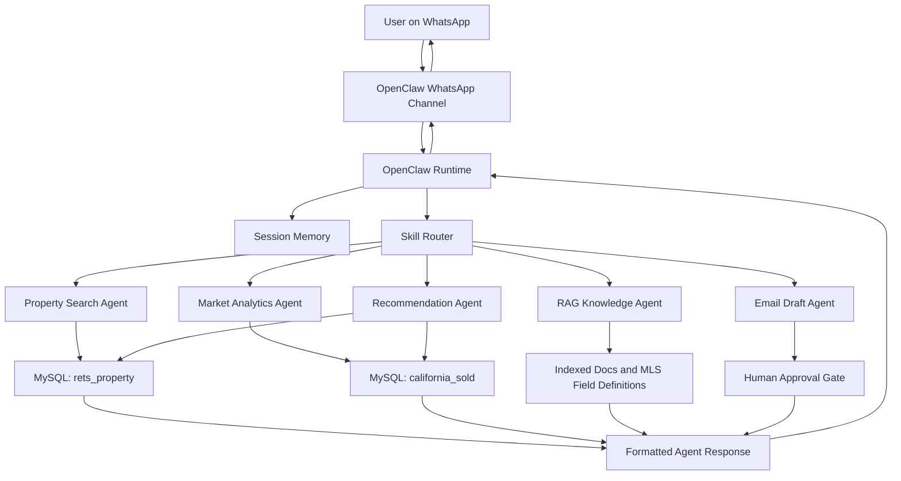

# IDX-Exchange-AI-Agent

Production-style multi-agent real estate assistant built with OpenClaw, OpenAI, MySQL MLS data, semantic search, RAG, WhatsApp integration, and human-in-the-loop safety workflows.

## Project Objective

Build a multi-agent AI assistant for real estate search and market intelligence. The system will let users search active MLS listings, ask market questions, receive property recommendations, and interact through WhatsApp using an OpenClaw-based agent runtime.

## Week 0 Status

- OpenClaw environment installed and running
- OpenAI API key configured
- WhatsApp test message working
- MySQL tables imported and verified

## Database Verification

The following tables were imported and cross-checked successfully:

- **rets_property**: 53,122 rows
- **california_sold**: 87,157 rows

## Planned Agent Modules

- Property search assistant
- Market analytics assistant
- Recommendation assistant
- RAG knowledge assistant
- Email drafting assistant
- Human approval workflow for sensitive actions

## Week 1: Architecture Fundamentals

This week focuses on understanding the OpenClaw architecture and documenting how user messages flow through the system.

## Core Concepts

OpenClaw is the orchestration layer that connects user messages, session state, skills, tools, and database-backed retrieval into one conversational workflow. The goal of Week 1 is to understand the moving parts clearly enough to explain how a message travels from WhatsApp into the system and back to the user as a response.

## Architecture Flow



## Key Components

- **Skills** — modular capability units such as property search, market stats, RAG, and recommendations
- **Channels** — communication interfaces such as WhatsApp, email, and web
- **Sessions** — per-user conversation state and memory
- **Tools** — typed async functions the agent can call for structured actions
- **Memory** — short-term session state plus long-term vector storage
- **Orchestrator** — routes each query to the correct skill or agent

## Basic Tool Definition

```ts
export async function getCurrentTime() {
  return { currentTime: new Date().toISOString() };
}

export async function handleMessage(message: string) {
  if (message.toLowerCase().includes("time")) {
    return await getCurrentTime();
  }

  return { response: "I could not understand the request." };
}
```

## Week 1 Deliverable

Architecture documentation with a workflow diagram showing how a user query moves from WhatsApp through OpenClaw skills to the MLS databases.

## Week 2: Natural Language Property Search

For Week 2, I built the first version of the natural language property search parser. The goal was to take normal user messages from WhatsApp and turn them into a structured filter object that can later be passed into the MySQL query layer.

The main implementation lives in `src/propertyQueryParser.ts`, with validation coverage in `tests/propertyQueryParser.test.ts`.

### What the Parser Does

The parser currently extracts:

- City
- Maximum price
- Minimum bedrooms
- Minimum bathrooms
- Minimum square footage
- Property type
- Pool requirement
- View requirement
- Maximum HOA fee

It also maps those extracted values to the matching `rets_property` database columns so Week 3 can use the output to build SQL queries.

### Example Query

```txt
Show me 3-bedroom condos in Irvine under $1.5M with a pool.
```

### Parsed Output

```json
{
  "city": "Irvine",
  "maxPrice": 1500000,
  "beds": 3,
  "baths": null,
  "sqft": null,
  "type": "Condominium",
  "pool": "True",
  "hasView": null,
  "maxHoa": null,
  "dbColumnFilters": {
    "L_City": "Irvine",
    "L_SystemPrice": {
      "lte": 1500000
    },
    "L_Keyword2": {
      "gte": 3
    },
    "L_Type_": "Condominium",
    "PoolPrivateYN": "True"
  }
}
```

### Database Mapping

| User Intent | Database Column | Example |
| --- | --- | --- |
| City | `L_City` | `Irvine` |
| Max price | `L_SystemPrice` | `1500000` |
| Min bedrooms | `L_Keyword2` | `3` |
| Min bathrooms | `LM_Dec_3` | `2.5` |
| Min square feet | `LM_Int2_3` | `1800` |
| Property type | `L_Type_` | `Condominium` |
| Pool | `PoolPrivateYN` | `True` |
| View | `ViewYN` | `True` |
| Max HOA | `AssociationFee` | `500` |

### Test Coverage

I added 12 test queries covering different user phrasings, including:

- Condos in Irvine under `$1.5M` with a pool
- Newport Beach homes with beds, baths, price, and ocean view
- Townhomes with minimum square footage
- HOA limits
- Single-family homes
- Land queries
- Decimal bathrooms like `2.5 baths`
- Compact aliases like `3 br 2 ba`
- Unsupported queries returning empty filters

The tests can be run with:

```bash
npm test
```

Current validation status: 12 tests passing.

## Notes

This repository will be updated week by week as the project expands from architecture fundamentals into live query handling, retrieval workflows, and production-style agent orchestration.
