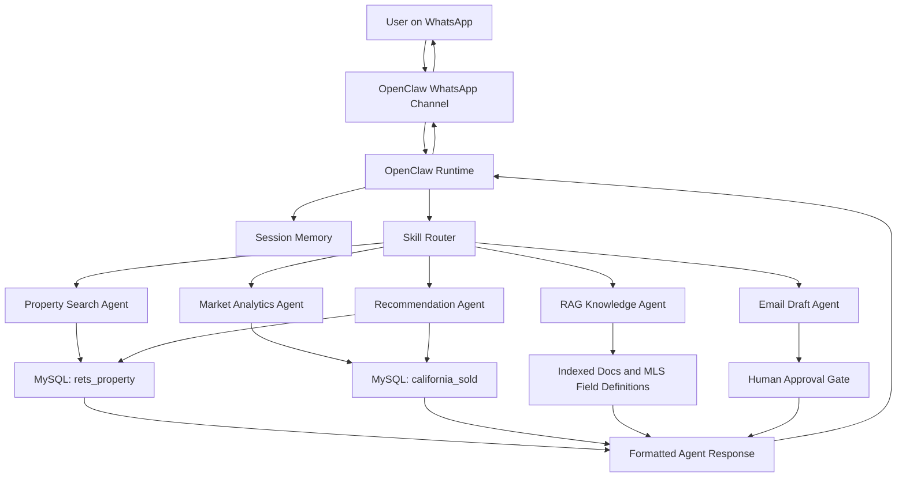

# IDX-Exchange-AI-Agent

Production-style multi-agent real estate assistant built with OpenClaw, OpenAI, MySQL MLS data, semantic search, RAG, WhatsApp integration, and human-in-the-loop safety workflows.

## Project Objective

Build a multi-agent AI assistant for real estate search and market intelligence. The system will let users search active MLS listings, ask market questions, receive property recommendations, and interact through WhatsApp using an OpenClaw-based agent runtime.

## Week 0 Status

- OpenClaw environment installed and running
- OpenAI API key configured
- WhatsApp test message working
- MySQL tables imported and verified

## Database Verification

The following tables were imported and cross-checked successfully:

- **rets_property**: 53,122 rows
- **california_sold**: 87,157 rows

## Planned Agent Modules

- Property search assistant
- Market analytics assistant
- Recommendation assistant
- RAG knowledge assistant
- Email drafting assistant
- Human approval workflow for sensitive actions

## Week 1: Architecture Fundamentals

This week focuses on understanding the OpenClaw architecture and documenting how user messages flow through the system.

## Core Concepts

OpenClaw is the orchestration layer that connects user messages, session state, skills, tools, and database-backed retrieval into one conversational workflow. The goal of Week 1 is to understand the moving parts clearly enough to explain how a message travels from WhatsApp into the system and back to the user as a response.

## Architecture Flow


```mermaid
flowchart TD
    A[User on WhatsApp] --> B[OpenClaw WhatsApp Channel]
    B --> C[OpenClaw Runtime]
    C --> D[Session Memory]
    C --> E[Skill Router]

    E --> F[Property Search Agent]
    E --> G[Market Analytics Agent]
    E --> H[Recommendation Agent]
    E --> I[RAG Knowledge Agent]
    E --> J[Email Draft Agent]

    F --> K[MySQL: rets_property]
    G --> L[MySQL: california_sold]
    H --> K
    H --> L
    I --> M[Indexed Docs and MLS Field Definitions]
    J --> N[Human Approval Gate]

    K --> O[Formatted Agent Response]
    L --> O
    M --> O
    N --> O

    O --> C
    C --> B
    B --> A
```

## Key Components

- **Skills** — modular capability units such as property search, market stats, RAG, and recommendations
- **Channels** — communication interfaces such as WhatsApp, email, and web
- **Sessions** — per-user conversation state and memory
- **Tools** — typed async functions the agent can call for structured actions
- **Memory** — short-term session state plus long-term vector storage
- **Orchestrator** — routes each query to the correct skill or agent

## Basic Tool Definition

```ts
export async function getCurrentTime() {
  return { currentTime: new Date().toISOString() };
}

export async function handleMessage(message: string) {
  if (message.toLowerCase().includes("time")) {
    return await getCurrentTime();
  }

  return { response: "I could not understand the request." };
}
```

## Week 1 Deliverable

Architecture documentation with a workflow diagram showing how a user query moves from WhatsApp through OpenClaw skills to the MLS databases.

## Week 2: Natural Language Property Search

For Week 2, I built the first version of the natural language property search parser. The goal was to take normal user messages from WhatsApp and turn them into a structured filter object that can later be passed into the MySQL query layer.

The main implementation lives in `src/propertyQueryParser.ts`, with validation coverage in `tests/propertyQueryParser.test.ts`.

### What the Parser Does

The parser currently extracts:

- City
- Maximum price
- Minimum bedrooms
- Minimum bathrooms
- Minimum square footage
- Property type
- Pool requirement
- View requirement
- Maximum HOA fee

It also maps those extracted values to the matching `rets_property` database columns so Week 3 can use the output to build SQL queries.

### Example Query

```txt
Show me 3-bedroom condos in Irvine under $1.5M with a pool.
```

### Parsed Output

```json
{
  "city": "Irvine",
  "maxPrice": 1500000,
  "beds": 3,
  "baths": null,
  "sqft": null,
  "type": "Condominium",
  "pool": "True",
  "hasView": null,
  "maxHoa": null,
  "dbColumnFilters": {
    "L_City": "Irvine",
    "L_SystemPrice": {
      "lte": 1500000
    },
    "L_Keyword2": {
      "gte": 3
    },
    "L_Type_": "Condominium",
    "PoolPrivateYN": "True"
  }
}
```

### Database Mapping

| User Intent | Database Column | Example |
| --- | --- | --- |
| City | `L_City` | `Irvine` |
| Max price | `L_SystemPrice` | `1500000` |
| Min bedrooms | `L_Keyword2` | `3` |
| Min bathrooms | `LM_Dec_3` | `2.5` |
| Min square feet | `LM_Int2_3` | `1800` |
| Property type | `L_Type_` | `Condominium` |
| Pool | `PoolPrivateYN` | `True` |
| View | `ViewYN` | `True` |
| Max HOA | `AssociationFee` | `500` |

### Test Coverage

I added 12 test queries covering different user phrasings, including:

- Condos in Irvine under `$1.5M` with a pool
- Newport Beach homes with beds, baths, price, and ocean view
- Townhomes with minimum square footage
- HOA limits
- Single-family homes
- Land queries
- Decimal bathrooms like `2.5 baths`
- Compact aliases like `3 br 2 ba`
- Unsupported queries returning empty filters

The tests can be run with:

```bash
npm test
```

Current validation status: included in the full project test suite.

## Week 3: MLS Database Integration

For Week 3, I added the first database integration layer for the agent. This connects the Week 2 natural language filters to safe SQL query builders for the two MLS tables:

- `rets_property` for active listing search
- `california_sold` for sold comparable property search

The implementation is split across:

- `src/database.ts` for the reusable MySQL connection pool
- `src/mlsSearch.ts` for query building, search functions, pagination, and result formatting
- `tests/mlsSearch.test.ts` for unit validation without requiring a live database connection

### Active Listing Search

The active listing search accepts the structured filters from Week 2 and builds a parameterized SQL query. For example, a parsed query with city, price, bedrooms, property type, and pool filters becomes a SQL query against `rets_property`.

The query layer supports:

- City filter using `L_City`
- Max price using `L_SystemPrice`
- Minimum bedrooms using `L_Keyword2`
- Minimum bathrooms using `LM_Dec_3`
- Minimum square feet using `LM_Int2_3`
- Property type using `L_Type_`
- Pool using `PoolPrivateYN`
- View using `ViewYN`
- HOA limit using `AssociationFee`
- Pagination using `LIMIT` and `OFFSET`

All user-provided filter values are passed as SQL parameters instead of being directly inserted into the SQL string. Pagination values are sanitized as numbers before being placed into `LIMIT` and `OFFSET`, because the local MySQL prepared statement driver rejected placeholders for pagination during the live smoke test.

### Live Query Example

I tested the Week 3 layer against the local MySQL database with this natural language query:

```txt
Find condos in Irvine under 1500000 with 3 beds
```

That query is parsed into filters, passed into the active listing query layer, executed against `rets_property`, and formatted into property cards.

Example live results returned from the local database:

```json
[
  {
    "title": "44 Fallbrook",
    "location": "Irvine, 92604",
    "price": 735000,
    "beds": 3,
    "baths": "2.0",
    "sqft": 1084,
    "type": "Condominium",
    "status": "Active",
    "highlights": ["Built 1978", "47 days on market", "HOA $393", "28 photos"],
    "agent": "Yanfeng Wu",
    "office": "Pacific Sterling Realty"
  }
]
```

### Sold Comps Search

I also added a sold comps query for `california_sold`. It searches recent residential closed sales by city and month window, then sorts by the most recent close date.

This prepares the project for market comparison workflows such as:

- "Show recent sold comps in Irvine"
- "Compare this listing to nearby closed sales"
- "What have similar homes sold for recently?"

### Formatted Property Cards

The raw database rows are converted into cleaner card-style objects for downstream agents. This gives the agent a simpler response format instead of exposing raw SQL rows directly.

Example active listing card fields:

```json
{
  "title": "10 Main Street",
  "location": "Irvine, 92618",
  "price": 1495000,
  "beds": 3,
  "baths": 2,
  "sqft": 1800,
  "highlights": ["4 days on market", "Private pool", "14 photos"]
}
```

### Week 3 Validation

I added automated tests for:

- Parameterized active listing SQL
- Pagination logic
- SQL safety for potentially unsafe city text
- Empty or unsupported filter objects
- Pool, view, square footage, and HOA filters
- Sold comps SQL construction
- Invalid sold comp month defaults
- Active listing card formatting
- Missing listing fields
- Sold comp card formatting
- Full flow from natural language query to formatted property cards using an injected test executor

I also ran a live smoke test against the local MySQL database and confirmed that real active listing rows return as formatted property cards.

Current validation status: included in the full project test suite.

## Week 4: Conversational Property Search Agent

For Week 4, I extended the Week 3 single-turn search flow into a multi-turn conversation flow. Instead of requiring the user to provide every filter in one message, the agent now tracks structured property-search state across turns, asks for missing details, and runs the MLS search once enough information has been collected.

This is separate from OpenClaw's built-in conversational memory. OpenClaw can remember the raw chat context, but this project also needs deterministic application state that the code can inspect directly.

The implementation is split across:

- `src/userSession.ts` for structured per-user search state
- `src/conversationalPropertyAgent.ts` for the multi-turn conversation controller
- `src/liveWhatsappBridge.ts` for the local HTTP bridge used by the live WhatsApp/OpenClaw demo
- `openclaw-skill/SKILL.md` for the OpenClaw skill instructions that route property-search messages to the local bridge
- `tests/conversationalPropertyAgent.test.ts` for session, refinement, reset, and search-flow validation

### Why Structured Session State Exists

The Week 4 session object acts like the app's own checklist for a property search. It stores typed slots such as:

- City
- Maximum price
- Minimum bedrooms
- Bathrooms
- Square footage
- Property type
- Pool and view preferences
- HOA limit
- Last returned property cards
- Current conversation step

This lets the agent do simple deterministic checks like:

```ts
if (!session.maxPrice) {
  return "What is your max budget?";
}
```

That is faster and safer than asking the model to reread the whole chat history every turn and guess whether a user already mentioned a budget.

### Example Multi-Turn Flow

```txt
User: Find homes in Irvine
Agent: Got it — looking in Irvine. What is your max budget?

User: Under $1.2M
Agent: How many bedrooms do you need?

User: At least 3 beds
Agent: I found matching active listings:
1. 18 Willow Bend — Irvine, 92618 — $1,185,000 (3 beds, 2.5 baths, 1,740 sqft, 22 photos)
2. 42 Cypress Grove — Irvine, 92620 — $1,199,000 (3 beds, 2 baths, 1,605 sqft, 17 photos)
```

The important part is that each message only contains part of the full search, but the session combines them into one complete filter object before calling the Week 3 MLS query layer.

### Session Memory Design

The current implementation uses an in-memory `Map<string, UserSession>` keyed by `userId`.

```ts
const sessions = new Map<string, UserSession>();
```

Each user gets an independent session, so one user's Irvine search does not overwrite another user's Tustin search. The session can also be cleared when the user says something like `reset`, `restart`, or `start over`.

This is the right level of complexity for the local internship demo, but it has two production limitations:

- Sessions are lost when the Node process restarts
- Sessions are not shared across multiple server instances

In a production deployment, this session state would move to Redis or a database table so it can survive restarts and be shared across servers.

### Refinement Behavior

After results are shown, the user can refine the same search without starting over.

Example:

```txt
User: Find homes in Irvine under $1.2M with 3 beds
Agent: [returns matching active listings]

User: Add a pool
Agent: [reruns the same search with PoolPrivateYN = "True"]
```

The agent keeps the existing city, budget, property type, and bedroom filters, then merges the new pool preference into the same structured session.

### Week 4 Validation

I added automated tests for:

- Asking a follow-up question when budget is missing
- Combining filters across multiple turns
- Short replies such as `Irvine`, `$1.2M`, and `3` after follow-up questions
- Running the MLS search only after required slots are filled
- Storing returned property cards in `lastResults`
- Keeping sessions separate for different users
- Refining an existing search with a new pool filter
- Resetting a search session
- Returning a helpful message when no listings match

Current validation status: 30 tests passing.

### Live WhatsApp Demo Bridge

To test the Week 4 flow from WhatsApp, run the local bridge before messaging the OpenClaw agent:

```bash
npm run week4:bridge
```

The bridge stays running at:

```txt
http://127.0.0.1:3124/message
```

OpenClaw can call this endpoint through the `idx-property-search` skill. The bridge keeps the structured `UserSession` map alive while the process is running, so multi-turn messages can build on each other.

Example local bridge request:

```bash
curl -s http://127.0.0.1:3124/message \
  -H 'Content-Type: application/json' \
  -d '{"userId":"whatsapp-demo-user","message":"Find homes in Irvine"}'
```

Then continue with:

```bash
curl -s http://127.0.0.1:3124/message \
  -H 'Content-Type: application/json' \
  -d '{"userId":"whatsapp-demo-user","message":"Under $1.2M"}'
```

The same session will remember the city from the first turn and merge the budget from the second turn.

For live WhatsApp testing, make sure OpenClaw is routing this direct chat to the bridge instead of the default coding assistant. The OpenClaw config should allow `exec`/`process`, keep WhatsApp in `selfChatMode`, and set the direct chat prompt for both the E.164-style peer id and the normalized id:

```json
"tools": {
  "profile": "minimal",
  "alsoAllow": ["exec", "process"],
  "exec": {
    "timeoutSec": 60
  }
},
"channels": {
  "whatsapp": {
    "enabled": true,
    "selfChatMode": true,
    "dmPolicy": "allowlist",
    "allowFrom": ["18582411191"],
    "direct": {
      "+18582411191": {
        "systemPrompt": "Call the local IDX bridge for every property-search message and reply with only the returned JSON message field."
      },
      "18582411191": {
        "systemPrompt": "Call the local IDX bridge for every property-search message and reply with only the returned JSON message field."
      },
      "*": {
        "systemPrompt": "Call the local IDX bridge for every property-search message and reply with only the returned JSON message field."
      }
    }
  }
}
```

The wildcard direct prompt is a fallback for live demos where the WhatsApp peer id is normalized differently than expected. A healthy live test should produce this sequence:

```txt
User: Find homes in Irvine
Agent: Got it — looking in Irvine. What is your max budget?

User: Under $1.2M
Agent: How many bedrooms do you need?

User: 3 beds
Agent: I found 2 active listings for Irvine, SingleFamilyResidence, under $1,200,000, 3+ beds:
```

### Run Locally

Install dependencies:

```bash
npm install
```

Run the test suite:

```bash
npm test
```

Run a live database smoke test:

```bash
node --experimental-strip-types --input-type=module -e '
import { parsePropertyQuery } from "./src/propertyQueryParser.ts";
import { searchActiveListings, formatListingCard } from "./src/mlsSearch.ts";
import { closeDatabase } from "./src/database.ts";

const filters = await parsePropertyQuery("Find condos in Irvine under 1500000 with 3 beds");
const rows = await searchActiveListings(filters, { page: 1, limit: 3 });

console.log(JSON.stringify(rows.map(formatListingCard), null, 2));

await closeDatabase();
'
```

## Week 5: Market Statistics Agent

For Week 5, I added a market analytics engine powered by the historical `california_sold` table and current active inventory from `rets_property`. This lets the agent answer market questions such as:

- `Is now a good time to buy in San Diego?`
- `What is the average price per sq ft in Pasadena?`
- `Show Irvine median price and days on market over the last 12 months`
- `Compare active inventory vs sold volume in Newport Beach`

The implementation is split across:

- `src/marketQuestionParser.ts` for extracting city, ZIP, time window, and metric intent from natural language
- `src/marketAnalytics.ts` for parameterized SQL, median/average calculations, monthly trend points, and inventory comparison
- `src/marketStatisticsAgent.ts` for turning market analytics into a user-facing answer
- `src/marketStatisticsCli.ts` for local smoke tests and OpenClaw skill execution
- `openclaw-skill/MARKET_STATS_SKILL.md` for the Week 5 OpenClaw skill instructions
- `tests/marketAnalytics.test.ts` and `tests/marketQuestionParser.test.ts` for deterministic validation

### Core Metrics

The Week 5 agent currently calculates:

- Closed sale count for a city or ZIP
- Average and median close price
- Average price per square foot
- Average days on market
- List-to-close price ratio
- Active listing count vs. sold volume
- Months of supply
- Month-over-month average price trend
- Year-over-year average price trend when at least 13 monthly buckets are available

### Example Market SQL

The analytics engine uses parameterized queries against `california_sold`:

```sql
SELECT
  City,
  PostalCode,
  CloseDate,
  ClosePrice,
  ListPrice,
  LivingArea,
  DaysOnMarket,
  PropertyType,
  PropertySubType
FROM california_sold
WHERE PropertyType = ?
  AND CloseDate >= DATE_SUB(CURDATE(), INTERVAL ? MONTH)
  AND ClosePrice IS NOT NULL
  AND City = ?
ORDER BY CloseDate ASC
```

Active inventory is pulled separately from `rets_property`:

```sql
SELECT COUNT(*) AS activeCount
FROM rets_property
WHERE L_Status = ?
  AND L_City = ?
```

Keeping sold-market analytics and active inventory as separate queries makes the source of each metric explicit.

### Run Week 5 Locally

Run the full test suite:

```bash
npm test
```

Ask a live market question against the local MySQL database:

```bash
npm run week5:market -- "What is the average price per sq ft in Pasadena?"
```

Example live result from the local database:

```txt
Market snapshot for Pasadena over the last 12 months:
- Closed sales: 498
- Median close price: $1,277,500
- Average close price: $1,539,977
- Average price per sqft: $823.15
- Average days on market: 39.6 days
- List-to-close ratio: 103%
- Active vs sold inventory: 277 active / 498 sold (6.7 months of supply)
- Latest month-over-month average price trend: up 10.2%
- Year-over-year average price trend: not enough data
```

Current validation status after Week 5: 41 automated tests passing, plus live MySQL smoke tests for Pasadena, San Diego, and Irvine market questions.

## Week 6: Embeddings and Vector Search

Week 6 adds semantic property search on top of the active `rets_property` inventory. Instead of requiring exact keyword overlap, the agent can understand free-text descriptions such as:

- `Find a charming craftsman with mountain views and character`
- `I want a peaceful modern home surrounded by nature`
- `Show me a bright coastal property with an open layout`
- `Find a historic home with original details and a large garden`

The implementation uses the OpenAI `text-embedding-3-small` model by default. It turns each active listing into a rich text document containing the property type, city, ZIP, beds, baths, square footage, year built, price, and `L_Remarks`. The same model embeds the user's query, and cosine similarity ranks the five closest listing vectors.

The Week 6 implementation is split across:

- `src/embeddings.ts` for normalized, batched OpenAI embedding requests
- `src/semanticPropertySearch.ts` for active-listing SQL, index creation, index persistence, cosine similarity, and ranking
- `src/semanticPropertyAgent.ts` for formatting the top five matches
- `src/semanticIndexCli.ts` for building or refreshing the local vector index
- `src/semanticPropertyCli.ts` for direct semantic-search smoke tests and OpenClaw execution
- `openclaw-skill/SEMANTIC_PROPERTY_SKILL.md` for the Week 6 OpenClaw skill instructions
- `tests/embeddings.test.ts` and `tests/semanticPropertySearch.test.ts` for deterministic validation

### How the Semantic Index Works

Generating a vector for every listing on every search would be slow and waste API credits. Week 6 therefore uses a reusable local index:

1. Query active listings with non-empty `L_Remarks` from MySQL.
2. Build one searchable text document per listing.
3. Generate embeddings in batches of 50.
4. Save listing metadata and vectors to `data/semantic-listing-index.json`.
5. Embed each new user query once and rank the saved vectors with cosine similarity.

The generated index is runtime data and is ignored by Git. Rebuild it whenever the active listing data changes significantly.

### Week 6 Configuration

Create a private `.env` file from the included template:

```bash
cp .env.example .env
```

Add the OpenAI key to `.env`:

```env
OPENAI_API_KEY=your-openai-api-key
OPENAI_EMBEDDING_MODEL=text-embedding-3-small
```

The Week 6 npm commands automatically load this file when it exists. `.env` is ignored by Git and must never be committed.

### Build the Listing Index

Build a 1,000-listing development index:

```bash
npm run week6:index -- --limit 1000
```

Build a smaller city-specific index for quick testing:

```bash
npm run week6:index -- --limit 250 --city Pasadena
```

Build embeddings for every active listing that has remarks:

```bash
npm run week6:index -- --all
```

The default batch size is 50. It can be changed with `--batch-size`, but the implementation caps batches at 100.

### Run Semantic Search

After the index exists, run:

```bash
npm run week6:search -- "charming craftsman with mountain views and character"
```

The response contains the top five active listings, their semantic similarity scores, core property facts, and a short listing-description preview.

When the school-district enrichment has been run, the same CLI and WhatsApp semantic-search responses also show each matched unified school district and county. Listings outside unified-district coverage are labeled as unavailable.

Current validation status after Week 6: 53 automated tests passing, plus a live OpenAI smoke test that embedded 1,000 active listings and returned five semantically relevant mountain-property matches.

## Unified School District Mapping

The project includes school-district enrichment using the authoritative California School District Areas 2025-26 GeoJSON. It filters the boundaries to `DistrictType = "Unified"`, converts each active listing's latitude and longitude to a geographic point, and performs a point-in-polygon spatial join with GeoPandas.

The implementation is additive, so it does not alter the imported `rets_property` table or risk the working search flows:

- `scripts/enrich_school_districts.py` downloads and processes the boundary data
- `property_school_district` stores one mapping row per listing in MySQL
- `data/school-districts/property-school-district-mapping.csv` is the saved enriched dataset
- `src/schoolDistrict.ts` provides a parameterized lookup for future agents
- `tests/test_school_district_enrichment.py` validates unified filtering and spatial mapping

### Set Up GeoPandas

Create a dedicated Python 3.12 environment and install the GIS dependencies:

```bash
/opt/homebrew/bin/python3.12 -m venv .venv-school-districts
.venv-school-districts/bin/python -m pip install -r requirements-school-districts.txt
```

### Run the Enrichment

Run a 1,000-listing smoke test:

```bash
npm run school-districts:enrich -- --limit 1000
```

Run all geocoded active listings:

```bash
npm run school-districts:enrich
```

The script downloads the official GeoJSON automatically if it is missing, saves the CSV mapping, creates `property_school_district` when needed, and safely upserts the results in batches. Both the downloaded boundaries and generated CSV are ignored by Git because they are reproducible runtime data.

Run the spatial-enrichment tests with:

```bash
npm run school-districts:test
```

Only unified districts are included, as requested. Properties served by separate elementary and high-school districts therefore remain explicitly unmatched rather than receiving an incorrect district assignment.

Current validation status: 67 Node tests and 3 GIS enrichment tests passing. The full local run processed 52,424 geocoded active listings and matched 40,984 of them to unified districts (78.2% coverage).

## Week 7: Hybrid Recommendation Engine

Week 7 recommends active properties from a listing the user already likes. It reuses the Week 6 semantic index, combines structured property similarity with embedding cosine similarity, and validates each final recommendation against recent `california_sold` pricing data.

The implementation is split across:

- `src/recommendationEngine.ts` for target lookup, hybrid scoring, ranking, and comp validation
- `src/recommendationAgent.ts` for data-backed recommendation formatting
- `src/recommendationCli.ts` for local and OpenClaw execution
- `openclaw-skill/RECOMMENDATION_SKILL.md` for WhatsApp routing
- `tests/recommendationEngine.test.ts` for deterministic scoring and query validation

### Hybrid Score

Each candidate can receive up to 100 points:

- Up to 20 points for price proximity
- 15 points for the same bedroom count
- 15 points for the same city
- Up to 10 points for square-footage proximity
- Up to 40 points from embedding cosine similarity

The first four components make up the 60-point structured score from the handbook. The semantic component contributes the remaining 40 points. The target listing is excluded before candidates are sorted, and the five highest total scores are returned.

### Sold-Comp Validation

The final five recommendations are checked against residential sales from the last six months in `california_sold`. Comparable rows must be in the same city and within 80% to 120% of the recommendation's living area.

For efficiency, all five city and square-footage bands are retrieved through one parameterized SQL query. The engine then calculates average sold price per square foot, estimated comp-supported price, comp count, and the listing's percentage above or below that estimate.

### Run Week 7 Locally

The Week 6 semantic index must already exist. Recommend from an indexed street address with:

```bash
npm run week7:recommend -- "Recommend homes like 33348 Robin Drive"
```

The CLI also accepts an indexed listing ID or display ID. A live validation for `33348 Robin Drive` returned five ranked active recommendations with hybrid-score breakdowns and sold-comp assessments in under one second.

Current validation status after Week 7: 67 automated Node tests passing, plus a live recommendation and MySQL comp-validation smoke test.

## Notes

This repository will be updated week by week as the project expands from architecture fundamentals into live query handling, retrieval workflows, and production-style agent orchestration.
